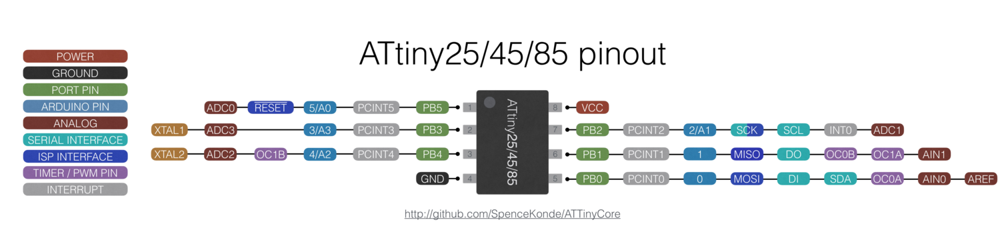

working
```bash
hex=/home/devdesk/dev/TinyAudioBoot/build/old/fading_fast_PB0.hex
hex=/home/devdesk/dev/TinyAudioBoot/build/old/fading_slow_PB0.hex
hex=/home/devdesk/dev/TinyAudioBoot/build/old/AudioBootAttiny85_AudioPB4_LedPB0_V3_1.hex

/home/devdesk/.arduino15/packages/arduino/tools/avrdude/6.3.0-arduino18/bin/avrdude \
    -C/home/devdesk/.arduino15/packages/ATTinyCore/hardware/avr/1.5.2/avrdude.conf \
    -v -pattiny85 \
    -cstk500v1 \
    -P/dev/ttyUSB0 \
    -b19200 \
    -Uflash:w:${hex}:i 
```

then 
```
java -jar AudioBootAttiny85.jar 
```

fuses
```
avrdude: safemode: lfuse reads as E1
avrdude: safemode: hfuse reads as DD
avrdude: safemode: efuse reads as FE
avrdude: safemode: Fuses OK (E:FE, H:DD, L:E1)
```

```
avrdude -P /dev/ttyACM0 \
-b 19200 -c avrisp -p t85 \
    -U efuse:w:0xfe:m \
    -U hfuse:w:0xdd:m \
    -U lfuse:w:0xe1:m

```

